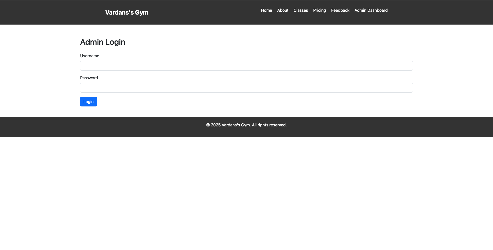

# 🏋️ Vardan's Gym Feedback Website + Sentiment Dashboard

A modern Flask-based gym website that lets users leave feedback and automatically analyzes sentiment using NLTK’s VADER tool. Designed with Bootstrap and MariaDB for a beautiful, robust, and production-ready experience. Admins can view analytics, delete feedback, and securely manage the dashboard.

---

## 📸 Screenshots

> _Demo of the project UI and dashboard_

- 🏠 Home Page  
  

- 📝 Feedback Form  
  

- 🔐 Admin Login  
  

- 📊 Admin Dashboard  
  

---

## 💡 Features

✅ Responsive gym website using **Bootstrap**  
✅ Feedback form with `name`, `email`, `rating`, and `message`  
✅ Sentiment analysis with **NLTK VADER**  
✅ Feedback stored in **MariaDB (MySQL)** instead of CSV  
✅ Admin login system with session-based protection  
✅ **Beautiful charts** using Chart.js:  
  • Doughnut chart for sentiment  
  • Bar chart for star ratings  
✅ Admin can **delete feedback entries**  
✅ Displays **total feedback count**  
✅ Shows **timestamp** (date) of each feedback  
✅ Flash messages for success & validation  
✅ Hosted live at: [🔗 vardanmalik.pythonanywhere.com](https://vardanmalik.pythonanywhere.com/)

---

## 🚀 How to Run Locally

### 1. Clone this repo

```bash
git clone https://github.com/VardanMalik/Sentiment-Analysis-for-targeted-Digital-Marketing-.git
cd gym-website
```

### 2. Create a virtual environment

```bash
python3 -m venv venv
source venv/bin/activate     # or venv\Scripts\activate on Windows
```

### 3. Install dependencies

```bash
pip install -r requirements.txt
```

#### If requirements.txt doesn’t exist, manually install:

```bash
pip install flask pandas nltk
python3
>>> import nltk
>>> nltk.download('vader_lexicon')
>>> exit()
```

### 4. Set Up the Database

> _Ensure MariaDB is running and create the database manually:_

```sql
CREATE DATABASE gym_feedback;
```

### 5. Check if MariaDB is running:

```bash
brew services list
```

> _If it’s not running just do:_

```bash
brew services start mariadb
```

### 6. Run the app

```bash
python3 app.py
```

#### Visit http://localhost:5000

---

## 🔐 Admin Credentials

> _Default (for demo purposes – change in app.py)_

```
Username: admin
Password: admin123
```
---

## 🔮 What Can Be Improved in the Future

- 🌍 OAuth-based login (Google Admin Login)

- 📅 Filter feedback by date range (monthly reports)

- 📤 Export data as CSV or PDF

- 🔔 Notifications for new feedback

- ✨ AI-driven insights and suggestions

- 📱 Mobile-first optimization

---

## 🧰 Tech Stack

- Python + Flask  
- HTML5 + CSS3 + Bootstrap
- NLTK (VADER Sentiment Analyzer)  
- Chart.js (for visualization)    
- JavaScript  
- MariaDB (via PyMySQL)
- Jinja2 Templating

---

## ⚙️ Requirements

- Python 3.10+  
- MySQL or MariaDB installed locally
- Internet access (for VADER lexicon & Chart.js)
- `nltk`, `flask`, `pandas`

---

## 📄 License

© 2025 Vardan Malik  
Licensed under the Apache License, Version 2.0 (the "License");  
you may not use this file except in compliance with the License.  
You may obtain a copy of the License at:

🔗 http://www.apache.org/licenses/LICENSE-2.0

Unless required by law or agreed to in writing, software  
distributed under the License is distributed on an "AS IS" BASIS,  
WITHOUT WARRANTIES OR CONDITIONS OF ANY KIND.  
See the License for the specific language governing permissions and limitations under the License.

