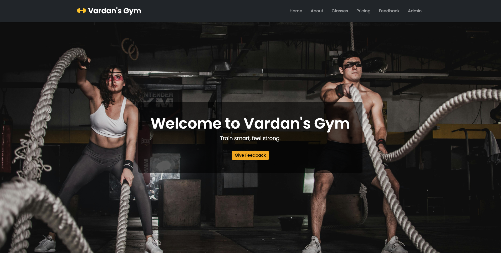
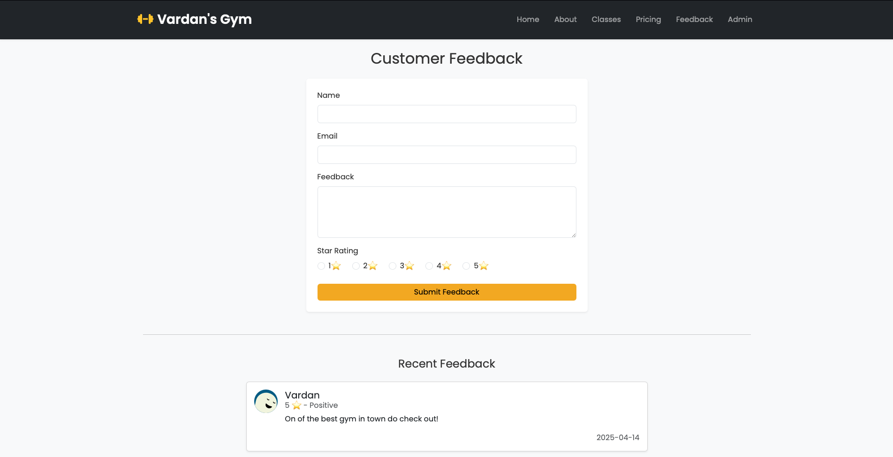
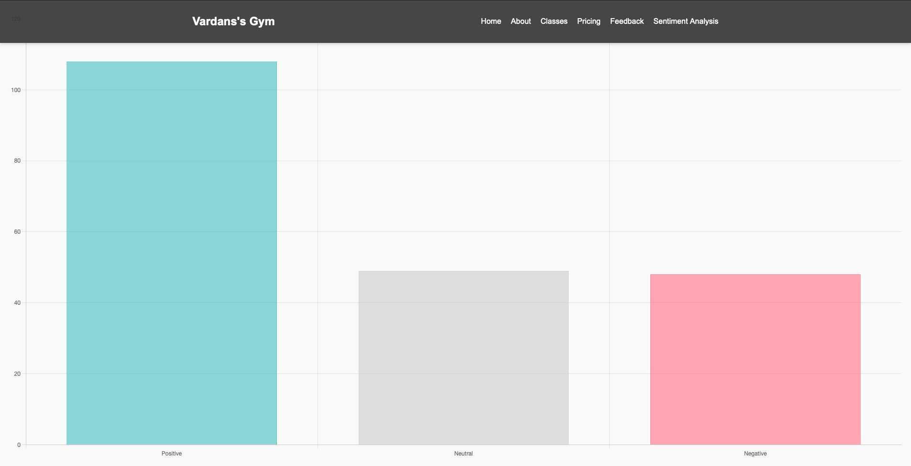

# 🏋️ Vardan's Gym Website + Sentiment Feedback System

A modern gym website with a built-in feedback system that collects user reviews and performs real-time sentiment analysis using NLTK's VADER tool. This platform helps gym owners understand customer satisfaction through automated insights.

---

## 📸 Screenshots

> _Replace these with actual screenshots of your running project_

- 
- 
- 

---

## 💡 Features

✅ Clean, responsive gym landing page  
✅ Feedback form with name, email, and message fields  
✅ Feedback is saved in a CSV file (`feedback.csv`)  
✅ Real-time sentiment analysis using VADER  
✅ Chart.js bar chart shows sentiment breakdown  
✅ Flash messages for form validation  
✅ Sentiment dashboard accessible at `/sentiment`

---

## 📂 Project Structure

gym-website/
├── app.py
├── feedback.csv               # Stores submitted feedback
├── static/                    # CSS, JS, images
│   ├── css/style.css
│   ├── js/script.js
│   └── images/
├── templates/                 # HTML files
│   ├── base.html
│   ├── index.html
│   ├── feedback.html
│   └── sentiment.html
├── venv/                      # Python virtual environment (optional)
└── README.md

---

## 🚀 How to Run Locally

### 1. Clone this repo

```bash
git clone https://github.com/VardanMalik/Sentiment-Analysis-for-targeted-Digital-Marketing-.git
cd gym-website

### 2. Create a virtual environment

```bash
python3 -m venv venv
source venv/bin/activate     # or venv\Scripts\activate on Windows

### 3. Install dependencies

```bash
pip install -r requirements.txt

# If requirements.txt doesn’t exist, manually install:

```bash
pip install flask pandas nltk
python3
>>> import nltk
>>> nltk.download('vader_lexicon')
>>> exit()

### 4. Run the app

```bash
python3 app.py

# Visit http://localhost:5000